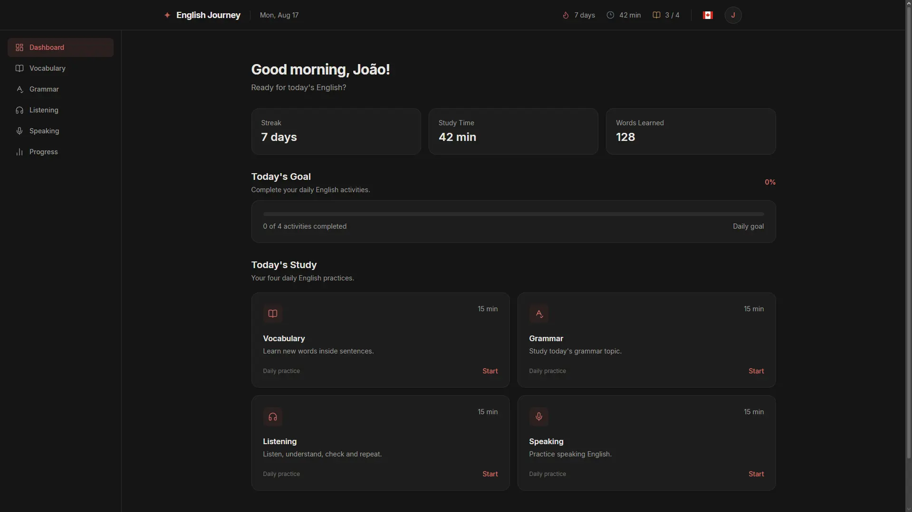

# English Journey

> A personal English learning platform built with React and TypeScript.

English Journey is a web application designed to support a consistent and structured English learning routine.

The project brings together vocabulary, grammar, listening, speaking and progress tracking into a single learning environment.

The application is being developed as a long-term project and will evolve alongside the learning journey.

---

## Preview



---

## About the Project

O English Journey foi criado para transformar o estudo de inglês em uma rotina mais organizada, consistente e mensurável.

A proposta é centralizar diferentes áreas do aprendizado em uma única plataforma:

- Vocabulary
- Grammar
- Listening
- Speaking
- Progress
- Daily Study

Além das áreas de estudo, o projeto possui um sistema de **onboarding**, desenvolvido para conhecer o perfil e as necessidades de cada aluno antes de iniciar sua jornada.

Durante o onboarding, o usuário informa:

- Seu nível atual de inglês
- Motivações para aprender inglês
- Habilidades que deseja desenvolver
- Tempo disponível para estudar
- Frequência semanal de estudos
- Nível de confiança em cada habilidade
- Habilidades que deseja priorizar
- Experiência anterior com inglês

Essas informações são reunidas em um perfil estruturado que futuramente será utilizado para criar uma jornada de aprendizagem personalizada.

Atualmente, o projeto está em sua fase inicial, com foco na construção da interface, arquitetura, experiência do usuário e fundamentos da aplicação.

---

## Features

### Onboarding

The onboarding is responsible for understanding the user's learning profile before starting the journey.

It currently includes:

- English level assessment
- Learning motivations
- Desired real-life abilities
- Daily study time
- Weekly study frequency
- Speaking confidence
- Listening confidence
- Reading confidence
- Writing confidence
- Skill priorities
- Previous English experience
- Study experience duration
- Final profile summary

The onboarding collects these answers and generates a structured `journeyProfile` object containing the user's learning information.

Future plans include using this profile to generate a personalized learning journey.

### Dashboard

The dashboard acts as the user's daily study center.

It provides:

- Daily study activities
- Study time
- Vocabulary statistics
- Learning streak
- Daily goal
- Activity completion

### Vocabulary

Area dedicated to vocabulary development.

Future plans include:

- Learning words through sentences
- Word reviews
- Vocabulary history
- Dictionary API integration
- Personalized vocabulary
- AI-assisted explanations

### Grammar

Area focused on learning English grammar progressively.

Future plans include:

- Grammar lessons
- Exercises
- Error tracking
- Writing practice
- Grammar performance
- AI-assisted corrections and explanations

### Listening

Area dedicated to improving English comprehension through audio and video content.

Future plans include:

- Audio lessons
- Video lessons
- Comprehension questions
- Repetition exercises
- Listening history
- Vocabulary extracted from content

### Speaking

Area focused on developing speaking confidence and fluency.

Future plans include:

- Voice recordings
- Speaking exercises
- Weekly speaking challenges
- Recording history
- Speaking evolution
- AI-assisted feedback

### Progress

Centralized view of the user's learning progress.

Future plans include:

- Study statistics
- Weekly activity
- Vocabulary growth
- Grammar performance
- Listening progress
- Speaking evolution
- Achievements
- Streaks
- Personalized recommendations

---

## Learning Method

The project follows a structured learning routine based on four main areas:

| Activity   | Daily Goal |
| ---------- | ---------- |
| Vocabulary | 15 min     |
| Grammar    | 15 min     |
| Listening  | 15 min     |
| Speaking   | 15 min     |

Total recommended study time:

**Approximately 1 hour per day.**

The main goal is consistency rather than long study sessions.

The learning experience will progressively evolve according to the user's level, goals, available study time and individual needs.

---

## Roadmap

### Phase 1 — Foundation

- [x] Project setup
- [x] React configuration
- [x] TypeScript configuration
- [x] Tailwind CSS
- [x] Application layout
- [x] Header
- [x] Sidebar
- [x] Dashboard
- [x] Vocabulary page
- [x] Grammar page
- [x] Listening page
- [x] Speaking page
- [x] Progress page
- [x] Initial onboarding
- [x] Multi-step onboarding flow
- [x] User profile data collection
- [x] Onboarding validation
- [x] Learning profile summary
- [x] `journeyProfile` object

### Phase 2 — Personalized Journey

- [ ] Define learning journey structure
- [ ] Define levels and progression
- [ ] Connect onboarding profile to learning path
- [ ] Generate initial learning plan
- [ ] Create units and lessons
- [ ] Connect daily activities to the learning path
- [ ] Activity completion system
- [ ] Real progress calculation
- [ ] Study time tracking

### Phase 3 — Learning Systems

- [ ] Vocabulary system
- [ ] Grammar lessons
- [ ] Grammar exercises
- [ ] Listening activities
- [ ] Speaking recordings
- [ ] Writing practice
- [ ] Review system
- [ ] Learning history

### Phase 4 — Authentication and Data

- [ ] User registration
- [ ] User login
- [ ] Firebase Authentication
- [ ] Firestore integration
- [ ] User-specific progress
- [ ] Persistent study history
- [ ] Streak system
- [ ] Persistent vocabulary
- [ ] Persistent learning journey

### Phase 5 — Intelligence

- [ ] Dictionary API
- [ ] AI-assisted grammar explanations
- [ ] AI writing correction
- [ ] AI speaking feedback
- [ ] Personalized recommendations
- [ ] Adaptive study plans
- [ ] AI-assisted learning activities

---

## Technology

The project is currently built with:

- React
- TypeScript
- Vite
- Tailwind CSS
- React Router
- Lucide React

Future technologies may include:

- Firebase Authentication
- Firebase Firestore
- Dictionary APIs
- AI APIs

---

## Project Structure

```text
src/

├── components/

│   ├── Header/
│   └── Sidebar/

├── layouts/

│   └── Layout.tsx

├── pages/

│   ├── Dashboard/
│   ├── Vocabulary/
│   ├── Grammar/
│   ├── Listening/
│   ├── Speaking/
│   └── Progress/

├── App.tsx
└── main.tsx
```
